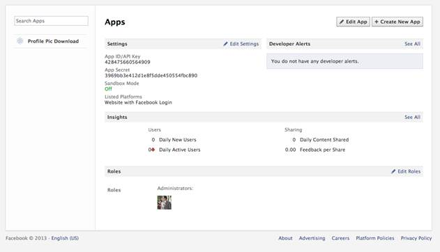
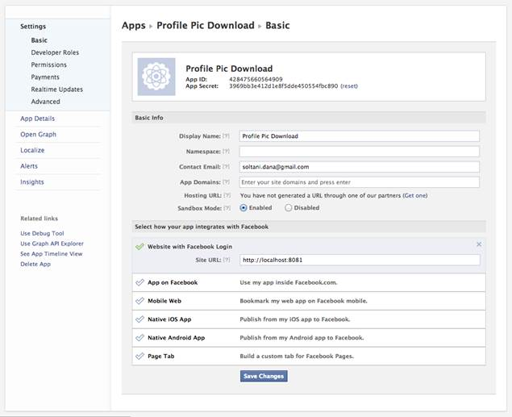
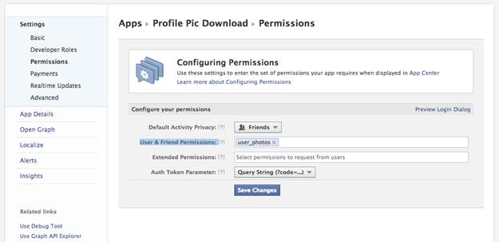
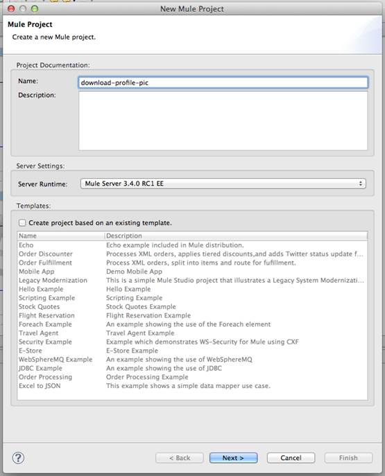
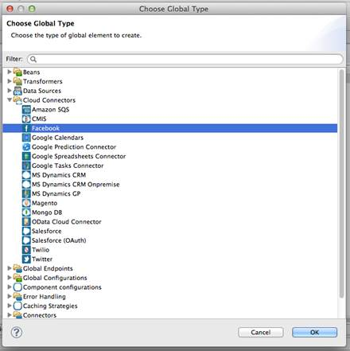
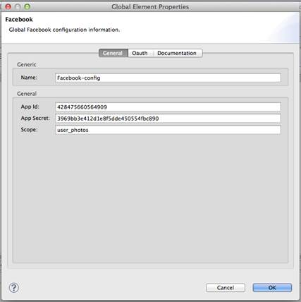

**Mule Sample: Integrating with Facebook®**
======================================================

Purpose
=======

In this sample, I'll show how to build a simple application with Mule that downloads user's profile picture from his facebook page.

Prerequisites
=============

In order to build and run this project you'll need
 

●     To have a Facebook account and signed up to become a Facebook developer at [http://developers.facebook.com](http://developers.facebook.com)

●     To have downloaded and installed [Mule Studio Community edition](http://www.mulesoft.org/download-mule-esb-community-edition) on your computer

Creating an app on Facebook
===========================

To be able to integrate to Facebook, you need to create an app on Facebook and give the right permissions to it.  You can create a Facebook app at [https://developers.facebook.com/apps](https://developers.facebook.com/apps). Click on "Create New App" on the top right corner of the page and you will be prompted for the app name - Figure 1. Enter your app name and click on "Continue".  I've named mine "Profile Pic Download".  You are taken to "Basic" tab of your app "Settings" page. Note "App Id" and "App Secret" on this page - Figure 2. You'll need these two values to build your Mule application. There are also two changes you need to make to the settings for your Mule app to get access to Facebook profiles and more specifically profile pictures:

(1) Since we are going to call Facebook API from a web page, you need to set "Site URL" in "Select how your app integrates with Facebook". This setting is on the same page that you see App id and secret. Click on "Website with Facebook Login" to check it and enter "<http://localhost:8081>" as value for "Site URL". This is the address, the OAuth request will be redirected after getting authenticated. Once you are done with editing "Site URL", click on "Save Changes".

(2) You also need to give your application permission to the profile photos. To do that, you need to go to "Permissions" tab and enter "user\_photos" in "User & Friend Permissions" input - Figure 3. Click on "Save Changes" when you are done.

After you make these two changes, you can start by building your app in Mule.

Figure 1. Creating a new Facebook App

Figure 2. Changing app settings

Figure 3. Giving the app permission to user photos

**Getting Mule Studio Ready**

If you haven't installed Mule Studio on your computer yet, it's time to download Mule Studio from this location: [http://www.mulesoft.org/download-mule-esb-community-edition](http://www.mulesoft.org/download-mule-esb-community-edition). You also have the option of downloading a 30 day trial of Mule Enterprise Edition from this location [http://www.mulesoft.com/mule-esb-enterprise](http://www.mulesoft.com/mule-esb-enterprise) if you want to evaluate and purchase the premium edition. This demo can be built using either community or enterprise edition. There is no specific installation that you need to run. Once you unzip the zip file to your desired location, you are ready to go. Facebook connector comes pre-installed with Mule Studio, so you don't need to download and install it separately. However if you need any other connector, you can download and install it from MuleStudio Cloud Connectors Update Site. To do that:

1. Open Mule Studio and from "Help" menu select "Install New Software...". Installation dialog box opens - Figure 4.

2. From "Work with" drop down, select "MuleStudio Cloud Connectors Update Site". The list of available connectors will be shown to you.

3. Find and select your connector in the list of available connectors, the tree structure that is shown. A faster way to find a specific connector is to filter the list by typing the name of the connector in the input box above the list. You can choose more than one connector to be installed at once.

4. When you are done selecting the connectors to be installed, click on "Next" button. Details of each connector are shown on the next page. Click on "Next" button again and accept the terms of the license agreement.

5. Click on "Finish" button. The connector is downloaded and installed onto Studio. You'll need to restart the Studio for the installation to be completed.

Figure 4. Installing connectors

**Setting up the project**

Now that you've got your Mule Studio up and running, it's time to work on the Mule App. Create a new Mule Project by clicking on "File \> New \> Mule Project". In the new project dialog box, the only thing you are required to enter is the name of the project. You can click on "Next" to go through the rest of pages - Figure 5.

Figure 5. Creating a new Mule app

The first thing to do in your new app is to configure the connection to Facebook. In the message flow editor, click on "Global Elements" tab on the bottom of the page. Then click on "Create" button on the top right of the tab. In the "Choose Global Element" type dialog box that opens select "Facebook" under "Cloud Connectors" and click ok - Figure 6.

 

Figure 6. Creating a new global element

 

In the Facebook configuration dialog box that follows, you need to enter the following information. On the "General" tab, enter a name for your configuration settings such as "Facebook-config". Also, put the "App Id" and "App Secret" you got when you created your app on Facebook website in their respective fields. App permissions must go to "Scope", in this case "user\_photos" - Figure 7. On the OAuth tab, you need to enter the callback URL that user requests will be redirected to after being authenticated by Facebook. Enter "localhost" in the "Domain" field and 8081 both in "Local Port" and "Remote Port". You are done with the configuration. Click "Ok" to close the dialog box. The XML for the global element should look like this:

    <facebook:config-with-oauth name="Facebook-config" appId="428475660564909" appSecret="3969bb3e412d1e8f5dde450554fbc890" doc:name="Facebook" scope="user\_photos">    
            <facebook:oauth-callback-config domain="localhost" localPort="8081" remotePort="8081"/>  
    </facebook:config-with-oauth>

   

Figure 7. Configuring the Facebook connection

**Building the flows**

It's time to build the flows that download user's profile picture now that we have our connection to Facebook set up in Mule app. You will actually need two flows for that. The first flow authorizes the user call using app id/secret and also his username and password and receives an OAuth token from Facebook and it calls the second flow. The second flow downloads and saves the user's picture - Figure 8. Here is how to create those flows:

**Authorize flow**: Start by dropping an HTTP endpoint on the flow from the palette. The only parameters you need to configure for this endpoint is "Host" and "Port". Change host to "localhost" and port to "8082". This is the URL you'd call to start this flow. Then drop a Facebook connector from the palette onto the endpoint. In the configuration dialog box, change "Config Reference" to "Facebook-config", the configuration you set up in the previous section. Also, select "Authorize" from the list of operations in the "Operation" dropdown. In the next step, you need to store the OAuth token that the previous step returns as a flow variable. This is needed in the other flow that downloads user's profile picture. As you know, flow variables cannot cross flow boundaries and thus you need to save the OAuth token in a session variable. Drop a Session Variable from the palette onto the Facebook connector and in the configuration dialog box, choose "Set Session Variable" for the "Operation". Furthermore, enter "accessTokenId" in the name field and "\#[flowVars['OAuthAccessTokenId']]" in the value field. This saves the OAuth token in a session variable called accessTokenId. The final step is to call the second flow. Drop a Flow Reference onto the Session Variable and in the configuration dialog box choose the second flow for "Flow Name". I've named the second flow "PhotoDownload". You are done with this flow.     

Figure 8. Creating flows in Mule app

**PhotoDownload flow:** This is the flow that actually downloads the profile picture having been authorized by the previous flow. Starts by adding an HTTP endpoint to the flow. Enter "localhost" as "Host" and "8081" as "Port" in the configuration dialog box. Then, take a Not Filter from the palette and drop it onto the HTTP endpoint you just created. Open the configuration dialog box and click the plus icon. Select "core:wildcard-filter" from the list and click next. In the next window, enter "/favicon.ico" in the pattern field and click finish. Then, take a Facebook connector from the palette and drop it onto the Not filter. Open the configuration dialog box and select "Facebook-config" from the list of available "Config References". Also, from the dropdown list of available operations, choose "Get user picture". This is for "Operation" field. Because you want to download the picture of the logged in user, you need to enter "me" for the "User" field. Furthermore, you need to pull the OAuth token you saved in the previous flow for the connection to work. You can do that by entering "\#[sessionVars['accessTokenId']]" in "Access Token Id" field. This operation will return the user profile picture as payload. The next step is to save the picture on local disk. Pull a File endpoint from the palette and drop it to the Facebook connector. Enter where you want the picture to be saved in the "Path" field and the name of the file in "Output pattern" field on the configuration dialog box. The last step is to add an "Object to JSON" transformer so the output can be displayed in the browser window.

**Flow XML**

The final flow XML should look like this. Pay attention "appId" and "appSecret" will be different for your app than the values here.

    <xml version="1.0" encoding="UTF-8"?>
    
    <mule xmlns:json="http://www.mulesoft.org/schema/mule/json"
    
                xmlns:tracking="http://www.mulesoft.org/schema/mule/ee/tracking" xmlns:file="http://www.mulesoft.org/schema/mule/file" xmlns:http="http://www.mulesoft.org/schema/mule/http" xmlns:facebook="http://www.mulesoft.org/schema/mule/facebook" xmlns="http://www.mulesoft.org/schema/mule/core" xmlns:doc="http://www.mulesoft.org/schema/mule/documentation" xmlns:spring="http://www.springframework.org/schema/beans" version="EE-3.4.0" xmlns:xsi="http://www.w3.org/2001/XMLSchema-instance" xsi:schemaLocation="  
    http://www.mulesoft.org/schema/mule/json http://www.mulesoft.org/schema/mule/json/current/mule-json.xsd  
    http://www.mulesoft.org/schema/mule/http http://www.mulesoft.org/schema/mule/http/current/mule-http.xsd
    http://www.mulesoft.org/schema/mule/file http://www.mulesoft.org/schema/mule/file/current/mule-file.xsd
    http://www.mulesoft.org/schema/mule/facebook http://www.mulesoft.org/schema/mule/facebook/2.0/mule-facebook.xsd
    http://www.springframework.org/schema/beans http://www.springframework.org/schema/beans/spring-beans-current.xsd
    http://www.mulesoft.org/schema/mule/core http://www.mulesoft.org/schema/mule/core/current/mule.xsd
    http://www.mulesoft.org/schema/mule/ee/tracking http://www.mulesoft.org/schema/mule/ee/tracking/current/mule-tracking-ee.xsd "> 
    
        <facebook:config-with-oauth name="Facebook-config" appId="428475660564909" appSecret="3969bb3e412d1e8f5dde450554fbc890" doc:name="Facebook" scope="user\_photos">
            <facebook:oauth-callback-config domain="localhost" localPort="8081" remotePort="8081"/>
        </facebook:config-with-oauth>
    
        <flow name="Authorize" doc:name="Authorize">
            <http:inbound-endpoint exchange-pattern="request-response" host="localhost" port="8082" doc:name="HTTP"/>
            <facebook:authorize config-ref="Facebook-config" doc:name="Authorize"/>
            <set-session-variable doc:name="Save Access Token" value="\#[flowVars['OAuthAccessTokenId']]" variableName="accessTokenId"/>
            <flow-ref name="PhotoDownload" doc:name="Call Photo Download"/>
        </flow>
    
        <flow name="PhotoDownload" doc:name="PhotoDownload">
            <http:inbound-endpoint exchange-pattern="request-response" host="localhost" port="8081"  doc:name="HTTP"/>
			<not-filter doc:name="Not">
            	<wildcard-filter pattern="/favicon.ico" caseSensitive="true"/>
        	</not-filter>
            <facebook:get-user-picture config-ref="Facebook-config" user="me" doc:name="Get Profile Picture" accessTokenId="\#[sessionVars['accessTokenId']]"/>
            <file:outbound-endpoint responseTimeout="10000" doc:name="Save the Picture" path="/Users/dana/Desktop" outputPattern="picture.jpg"/>
            <json:object-to-json-transformer doc:name="Object to JSON"/>
        </flow>
     </mule>

**Testing the app**

Now it's time to test the app. Run the app in Mule Studio and open a browser window. Enter "<http://localhost:8082>" in the navigation bar and press Enter. You are asked to sign into your Facebook account and give the app access to your profile and your photos. Then, you are redirected to "<http://localhost:8081>". If you go to the directory you specified in the application on your local disk, you will find your profile picture there.

Other resources
===============

For more information on:

●     Facebook connector, please visit [http://www.mulesoft.org/extensions/facebook-connector](http://www.mulesoft.org/extensions/facebook-connector)  
●     Mule AnyPoint® connectors, please visit [http://www.mulesoft.org/extensions](http://www.mulesoft.org/extensions)  
●     Mule platform and how to build Mule apps, please visit  [http://www.mulesoft.org/documentation/display/current/Home](http://www.mulesoft.org/documentation/display/current/Home)

